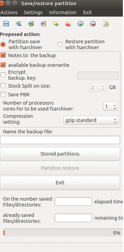

## Backup de Sistema Operativo, configuraciones y aplicaciones de los equipos de impresión de Blacky e Hija Resurrection

Este obra está bajo una licencia de [Creative Commons Reconocimiento-NoComercial-CompartirIgual 3.0 Unported.
](http://creativecommons.org/licenses/by-nc-sa/3.0/deed.es_ES)

### 1- Backup del sistema

Para acceder a la imagen de backup del sistema operativo, configuraciones y aplicaciones de los ordenadores ASROB de control de las impresoras Blacky e Hija Resurrection haga clic aquí..

*Figura 1: Backup del sistema*

### 2- Reinstalación del backup 

Para llevar a cabo la reinstalación de un Backup ya realizado, por favor, consulte el manual de mantenimiento de las impresoras, en el ANEXO 3, mediante( [acceder](https://github.com/asrob-uc3m/impresoras-maintenance-manual-i3/blob/master/anexo_3_reinstalacion_de_sistema_operativo_software_y_configuraciones_desde_backup.md) )

*Figura 2: Reinstalación del Backup*

### 3- Realizar un nuevo backup del sistema

Para llevar a cabo la un nuevo  Backup del sistema, por favor, consulte el manual de mantenimiento de las impresoras, en el ANEXO 4, facilitado, mediante( [acceder](https://github.com/asrob-uc3m/impresoras-maintenance-manual-i3/blob/master/anexo_4_proceso_de_backup_del_s.o_configuraciones_y_software.md) )

*Figura 3: Proceso de backup*
